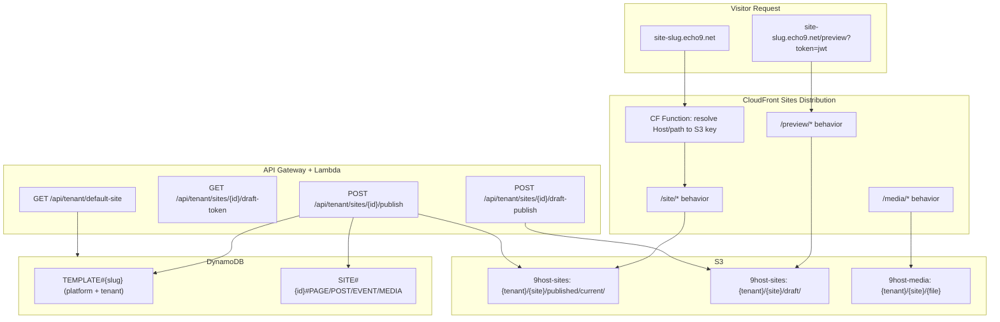

# Live Site Hosting MVP Plan

> **Status:** Implemented (Phases 1–2, 4–6). Phase 3 (custom domain resolution) deferred.

## Overview

A comprehensive MVP plan to make tenant websites viewable live on the internet at `<site-slug>.echo9.net`, with token-based draft previews, full HTML template layouts per template, Blogger-style module toggles, and tenant template forking (copy-on-write).

## Current State (Post-Implementation)

- **Template HTML/CSS:** Each template has its own layout and CSS theme. Publish uses `api/templates/` renderers.
- **Draft preview:** Token-based URL `{site-slug}.echo9.net/preview?token=jwt`. Draft publish to S3 `draft/` prefix.
- **Module gating:** Publish respects `resolved_features`; content editor tabs gated by `FeatureGate`.
- **Tenant template forking:** Fork API, CRUD, publish support, frontend fork UI and template picker.
- **404 page:** Template-aware 404.html published with each site.
- **SEO:** sitemap.xml, robots.txt, meta tags (description, og:title, og:image).
- **Debug cleanup:** `[9host debug]` prints removed from handler, middleware, sites_handler, api.ts.

**Deferred:** Phase 3 (custom domain resolution via CloudFront KVS). Custom domains require Lambda@Edge to change origin by host; CF Functions cannot do that.

---

## Architecture

---

## Phase 1: Template CSS/HTML System (DONE)

- `api/templates/` directory with `base_layout.py` and five template layouts
- Each template: `render_index`, `render_page`, `render_blog_index`, `render_post_detail`, `render_events`, `render_gallery`, `render_css`, `render_404`
- Branding injected as CSS custom properties
- Publish handler uses `get_renderer(template_slug)` and uploads `style.css`

---

## Phase 2: Draft Preview (DONE)

- **Draft publish:** `POST /api/tenant/sites/{id}/draft-publish` → renders to `{tenant}/{site}/draft/`
- **Draft token:** `GET /api/tenant/sites/{id}/draft-token` → JWT, 1hr expiry
- **CF Function:** `cf-preview-content.js` handles `/preview?token=jwt`, checks `exp`, rewrites to draft S3 prefix
- **Frontend:** "Preview draft" button → draft-publish → draft-token → open URL in new tab

---

## Phase 3: Custom Domain Resolution (DEFERRED)

Custom domain root routing would require Lambda@Edge to change origin by host. CloudFront Functions cannot make sub-requests or change origin. Left as a documented limitation for later.

---

## Phase 4: Module Gating (DONE)

- Publish: `_resolve_features()` from tenant tier + `module_overrides`; skips blog/events/gallery/branding when OFF
- Content editor: `FeatureGate` on Posts, Events, Media, Branding tabs

---

## Phase 5: Tenant Template Forking (DONE)

- Schema: `TENANT#{slug}` + `TEMPLATE#{slug}` with `forked_from`, `customizations`
- API: `POST /api/tenant/templates/fork`, `GET/PUT/DELETE /api/tenant/templates`
- Publish: resolves tenant template first, then platform; uses `forked_from` for renderer
- Frontend: ForkTemplateSheet, "(Custom)" badge in template picker

---

## Phase 6: Polish (DONE)

- **404 page:** `render_404()` in base layout; 404.html published with each site
- **SEO:** sitemap.xml, robots.txt (with Sitemap directive), meta tags in html_head
- **Debug cleanup:** Removed `[9host debug]` from sites_handler, middleware, api.ts

---

## Task Reference (TASKS.md)

| ID    | Task |
| ----- | ---- |
| 1.112 | Template layout system |
| 1.113 | Template layouts (5 templates) |
| 1.114 | CSS theme generation |
| 1.115 | Refactor publish handler |
| 1.116 | Draft publish |
| 1.117 | Draft token API |
| 1.118 | CF Function preview path |
| 1.122 | Publish: module toggles |
| 1.123 | Tenant template schema + fork API |
| 1.124 | Tenant template CRUD |
| 1.125 | Publish: tenant templates |
| 1.127 | 404 page |
| 1.128 | SEO (sitemap, robots, meta) |
| 1.106 | Remove debug instrumentation |
| 2.99  | Content editor: gate tabs |
| 2.100 | Draft preview button |
| 2.101 | Template fork UI |
| 2.102 | Tenant template settings (MVP lite) |
| 2.103 | Template picker: Custom badge |
