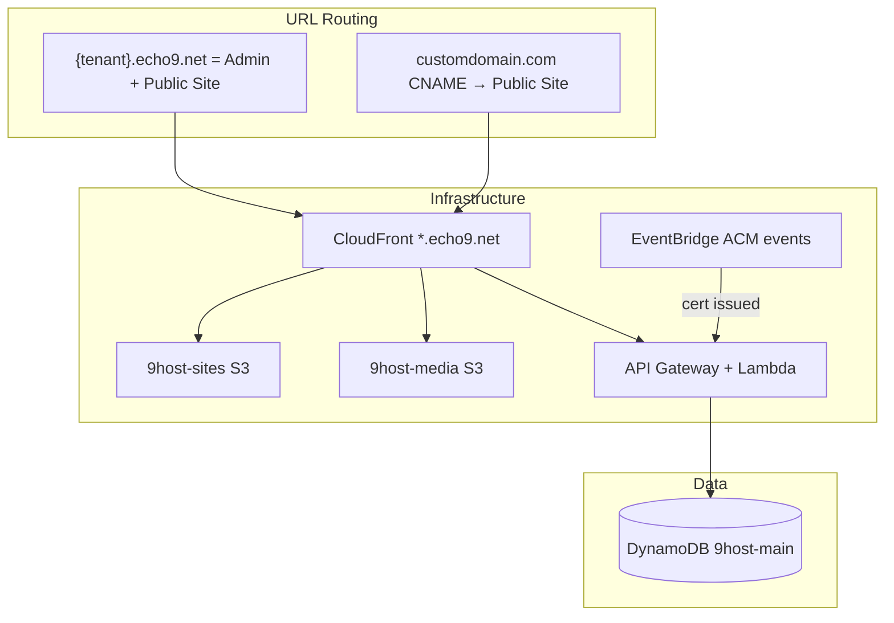
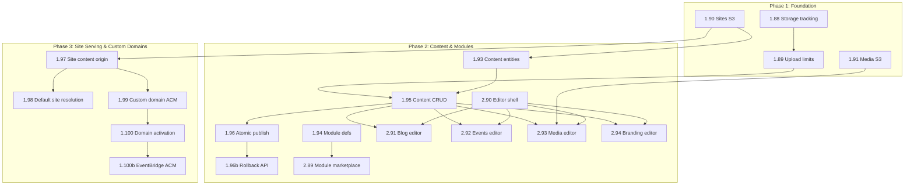

# Web Hosting System — Multi-Agent Plan (v3)

> **Scope:** Web hosting functionality for 9host. Analytics and payments are deferred.  
> **MVP scale:** 20–30 tenants. Architecture decisions optimized for this range.  
> **Reference:** [TASKS.md](../TASKS.md), [docs/SCHEMA.md](SCHEMA.md), [docs/TIERS.md](TIERS.md).  
> **Changelog:**  
> - v2: Architectural feedback (routing, SSL limits, hybrid rendering, content versioning, cache invalidation, quota enforcement).  
> - v2.1: Orphaned file cleanup (DELETE hook + optional background sweep).  
> - **v3: MVP-scoped revision.** Drop CloudFront cache invalidation (use short TTLs + hashed assets). Static HTML publish instead of hybrid rendering. Defer admin routing split (keep existing wildcard routing). Defer custom templates + quota override UI. Simplify ACM to one cert per custom domain. Event-driven domain activation via EventBridge (no polling Lambda). Remove orphan cleanup Lambda.

---

## 1. Architecture Overview



**Key design decisions:**
- **Admin URL (MVP):** `{tenant}.echo9.net` — uses existing wildcard distribution (task 1.78 DONE). Admin routing split to `app.echo9.net` deferred to post-MVP.
- **Public site:** `{tenant}.echo9.net` serves the tenant's published site. Public and admin share the same subdomain; path-based routing separates them.
- **Custom domains:** `customdomain.com` CNAME → CloudFront alias. One ACM cert per custom domain (no SAN aggregation). Domain activation via EventBridge (zero polling cost).
- **Site content:** S3 bucket `9host-sites`. **Static HTML publish** — template + DynamoDB content rendered to HTML and uploaded to S3. No client-side JS engine or JSON fetching. Fast, cacheable, works when API is down.
- **Caching:** Short TTLs on `index.html` (`Cache-Control: max-age=60, s-maxage=300`). Content-hashed filenames for assets (cached indefinitely). **No CloudFront invalidations.** Content updates visible within 5 minutes.
- **Modules:** updates/blog, events/shows, media gallery, branding — stored in DynamoDB, rendered to static HTML on publish.

---

## 2. Architectural Decisions (v3 — MVP-Scoped)

### A. Routing: Wildcard (MVP) — Deferred Split

**Decision (MVP):** Admin and public site both live at `{tenant}.echo9.net`, using the existing wildcard CloudFront distribution (task 1.78 DONE). Path-based routing separates admin from public content.

**Deferred:** `app.echo9.net/{tenant}` routing split, cross-subdomain cookie policy (1.92b), and admin URL migration (2.88). Revisit post-MVP when admin/public separation becomes a UX concern.

### B. SSL/TLS: One ACM Cert Per Custom Domain

**Decision:** Each custom domain gets its own ACM certificate (DNS-validated). CloudFront supports multiple certs via SNI. No SAN aggregation — avoids cert re-issue on every domain addition, avoids 100-SAN limit entirely.

**Scale note:** At 20–30 tenants, well within CloudFront alias limits (~100 default) and ACM cert limits (default 2,500 per region). Revisit multi-distribution strategy at 50+ custom domains.

### C. Static HTML Publish (Not Hybrid)

**Decision:** On publish, render template + DynamoDB content into static HTML/CSS/JS and upload to S3 `published/` prefix. The published site is pure static files — no client-side JSON fetching, no "site engine" JS bundle.

**Rationale:** At 20–30 tenants, a full rebuild takes <2 seconds per site. Static HTML is maximally fast (no API latency on page load), maximally cacheable, SEO-friendly, and works even if the API is down. Hybrid rendering adds client-side complexity (CORS, loading states, error handling, SEO issues) that is not justified at MVP scale.

### D. Content Versioning & Drafts

Content entities (1.93) include `status: DRAFT | PUBLISHED` and `published_at` timestamp. Draft content stored separately from published. Editor saves to draft; "Publish" promotes to published and triggers a static rebuild + S3 upload.

### E. Cache Strategy (No Invalidations)

**Decision:** No CloudFront invalidations. Instead:
- `index.html` and content pages: `Cache-Control: max-age=60, s-maxage=300` (CloudFront refreshes within 5 min).
- JS/CSS/images: content-hashed filenames (e.g. `main.a1b2c3.js`) with `Cache-Control: max-age=31536000, immutable`.

**Cost:** $0. Content updates visible within 5 minutes. At 20–30 tenants, this is imperceptible. A manual "force refresh" (single targeted invalidation) can be added later if needed.

### F. Quota Enforcement (Simplified)

**MVP:** Per-upload size limit via S3 Pre-signed POST `content-length-range` condition (e.g. 10MB per file). Track `storage_used_bytes` on the tenant record for visibility. Full cumulative quota enforcement, quota API, and superadmin override deferred to post-MVP.

### G. Orphaned File Cleanup (DELETE Hook Only)

On DELETE of content (post, media, etc.), the Content CRUD API removes associated S3 objects and decrements `storage_used_bytes`. No background sweep Lambda — at 20–30 tenants, orphaned files cost fractions of a cent. Run a manual cleanup script quarterly if needed.

### H. Domain Activation: EventBridge (Zero Polling Cost)

**Decision:** ACM emits EventBridge events on certificate status changes. An EventBridge rule matching `aws.acm` / `ACM Certificate Available` triggers a Lambda that: looks up the domain by cert ARN, adds the CloudFront alias, and flips domain status to `ACTIVE`.

**Cost:** $0. EventBridge rules for AWS service events are free. Lambda only fires when a cert actually validates — a few times per month at MVP scale. No polling Lambda running 288 times/day.

### I. Atomic Publish, Versioning & Rollback

**Problem:** The publish step uploads multiple files to S3 (HTML pages, CSS, JS, images). If the upload fails partway, a partial publish could become live. There is also no way to roll back to a previous version.

**Decision: Versioned publish with atomic pointer swap.**

**S3 key layout per site:**

```
{tenant_slug}/{site_id}/draft/           ← live draft content (overwritten on save)
{tenant_slug}/{site_id}/published/v1/    ← immutable publish snapshot
{tenant_slug}/{site_id}/published/v2/    ← immutable publish snapshot
{tenant_slug}/{site_id}/published/current.json  ← pointer to active version
```

**Publish flow (step 1.96):**

1. Read all content from DynamoDB (posts, pages, events, media refs, branding).
2. Render static HTML/CSS/JS using template + content.
3. Determine next version number: read `current.json` → increment (or `v1` if first publish).
4. Upload all rendered files to `published/v{N}/` prefix. Each file gets appropriate `Cache-Control` headers.
5. Upload `published/v{N}/manifest.json` — lists every file path, content hash (SHA-256), and publish timestamp.
6. **Only after all uploads succeed:** overwrite `current.json` with `{ "version": N, "published_at": "...", "manifest": "v{N}/manifest.json" }`.
7. Update the Site DynamoDB record: set `status: published`, `published_at`, `published_version: N`.

**Atomicity guarantee:** `current.json` is a single S3 PutObject — atomic. The CF Function reads `current.json` to resolve which version prefix to serve. Until step 6 completes, the old version stays live. A failed publish leaves an incomplete `v{N}/` directory that is never referenced.

**Rollback:** Update `current.json` to point to any previous version number. Instant, no re-upload. The publish API should support `POST /api/tenant/sites/{id}/rollback?version=N`.

**Manifest (`manifest.json`):**

```json
{
  "version": 2,
  "published_at": "2026-03-15T12:00:00Z",
  "files": [
    { "path": "index.html", "sha256": "abc123...", "size": 4096 },
    { "path": "assets/main.a1b2c3.css", "sha256": "def456...", "size": 1024 }
  ]
}
```

**Draft vs. Published storage model:**

- **DynamoDB content records** use `status: DRAFT | PUBLISHED` flag. Editor saves always write to draft. Publish promotes draft → published (copies the status flag, sets `published_at`).
- **S3 draft prefix** (`draft/`) holds the latest saved draft files — overwritten on each save. Used by the preview API (1.79).
- **S3 published prefix** (`published/v{N}/`) holds immutable snapshots. Never modified after upload. Old versions retained for rollback (clean up versions older than N-3 via lifecycle rule or manual sweep).

**Version retention (MVP):** Keep the last 3 published versions per site. At 20–30 tenants with small sites, storage cost is negligible. S3 lifecycle rules can auto-expire older versions if needed post-MVP.

---

## 3. Steps in Correct Order

### Phase 1: Foundation

| Step | ID | Agent | Description | Depends On |
|------|-----|-------|-------------|------------|
| 1 | 1.88 | agent1 | **Storage tracking schema:** Add `storage_used_bytes` to Tenant (updated on upload/delete). Extend [api/tier_config.py](../api/tier_config.py) with per-tier upload size limits. | — |
| 2 | 1.89 | agent1 | **Upload size enforcement:** Pre-signed POST with `content-length-range` condition (e.g. 10MB per file). No cumulative quota API — just per-upload limits. | 1.88 |
| 3 | 1.90 | agent1 | **Sites S3 bucket:** Create `9host-sites` bucket (prefix), OAC, versioning. Key layout: `{tenant_slug}/{site_id}/draft/`, `{tenant_slug}/{site_id}/published/v{N}/`, `{tenant_slug}/{site_id}/published/current.json`. | — |
| 4 | 1.91 | agent1 | **Media S3 bucket:** Create `9host-media` for tenant uploads (images, files). Key: `{tenant_slug}/{site_id}/{filename}`. | — |

**No dependencies (parallel start):** 1.88, 1.90, 1.91

---

### Phase 2: Content & Modules

| Step | ID | Agent | Description | Depends On |
|------|-----|-------|-------------|------------|
| 5 | 1.93 | agent1 | **Content entities (DynamoDB):** Define schema. Include `status: DRAFT | PUBLISHED` and `published_at` timestamp. E.g. `SITE#{id}#PAGE#{path}`, `SITE#{id}#POST#{id}`, `SITE#{id}#EVENT#{id}`, `SITE#{id}#MEDIA#{id}`. Document in [docs/SCHEMA.md](SCHEMA.md). | 1.90 |
| 6 | 1.94 | agent1 | **Module definitions:** Add platform module config (updates/blog, events_shows, media_gallery, branding). Extend `module_overrides` / `resolved_features`. | 1.28 (done) |
| 7 | 1.95 | agent1 | **Content CRUD API:** GET/POST/PUT/DELETE for pages, posts, events, media. Tenant-scoped, site-scoped. Per-upload size check before issuing pre-signed POST. On DELETE: remove S3 objects and decrement `storage_used_bytes`. | 1.93, 1.89 |
| 8 | 1.96 | agent1 | **Site publish API:** POST /api/tenant/sites/{id}/publish. Atomic versioned publish (see §2I): render static HTML → upload to `published/v{N}/` → write `manifest.json` → swap `current.json` pointer. Set `Cache-Control: max-age=60, s-maxage=300` on HTML; content-hashed filenames for assets with long cache. Update Site record (`published_version`, `published_at`). No CloudFront invalidation. | 1.95, 1.90 |
| 8b | 1.96b | agent1 | **Site rollback API:** POST /api/tenant/sites/{id}/rollback?version=N. Validate version exists (check `published/v{N}/manifest.json`), swap `current.json` to point to version N. Update Site record. Admin/manager only. | 1.96 |
| 9 | 2.89 | agent2 | **Module Marketplace expansion:** Add updates/blog, events_shows, media_gallery, branding to tenant-modules. | 1.94 |
| 10 | 2.90 | agent2 | **Content editor shell:** Site content editor layout (sidebar, page/post/event/media tabs). Placeholder for per-module editors. | — |
| 11 | 2.91 | agent2 | **Updates/Blog editor:** List posts, create/edit/delete. Draft vs Published. Publish flow. | 1.95, 2.90 |
| 12 | 2.92 | agent2 | **Events/Shows editor:** List events, CRUD, date/venue. | 1.95, 2.90 |
| 13 | 2.93 | agent2 | **Media gallery editor:** Upload via pre-signed POST, list, caption, reorder. | 1.95, 1.91, 2.90 |
| 14 | 2.94 | agent2 | **Branding editor:** Logo, colors, fonts. Store in site settings or content. | 1.95, 2.90 |

---

### Phase 3: Site Serving & Custom Domains

| Step | ID | Agent | Description | Depends On |
|------|-----|-------|-------------|------------|
| 15 | 1.97 | agent1 | **Site content origin:** Add 9host-sites as CloudFront origin on existing wildcard distribution. CF Function: resolve Host header → tenant + site → S3 path. | 1.90 |
| 16 | 1.98 | agent1 | **Default site resolution:** `{tenant}.echo9.net` → tenant's default site content from S3. | 1.97 |
| 17 | 1.99 | agent1 | **Custom domain ACM + CloudFront:** When domain verified, request a **dedicated ACM cert** (one per domain, not SAN aggregation). On cert issued, add alias to sites distribution. | 1.81 (done), 1.97 |
| 18 | 1.100 | agent1 | **Domain activation workflow:** On DNS verification pass, request ACM cert, store cert ARN on domain record with status `PENDING_VALIDATION`. EventBridge handles the rest (1.100b). | 1.99 |
| 19 | 1.100b | agent1 | **ACM validation via EventBridge:** EventBridge rule on `aws.acm` certificate status change → Lambda. On `ISSUED`: look up domain by cert ARN, add alias to CloudFront distribution, update domain status `PENDING_VALIDATION` → `ACTIVE`. Zero polling cost. | 1.100 |

**Note on 1.99a (quota verification):** At 20–30 tenants, well within CloudFront alias limit (~100) and ACM cert limit (~2,500/region). Not a separate task — documented here. Revisit at 50+ custom domains.

---

## 4. Post-MVP (Deferred)

The following features are deferred until after MVP launch (20–30 tenants). They remain planned but are not in the critical path.

### Deferred: Admin Routing Split

| ID | Agent | Description | Original Phase |
|----|-------|-------------|----------------|
| 1.92 | agent1 | **Routing split:** `app.echo9.net/{tenant}` = admin, `{tenant}.echo9.net` = public only. Separate CloudFront behaviors. | Phase 1 |
| 1.92b | agent1 | **Auth Cookie Policy:** Cross-subdomain cookie policy for `app.echo9.net`. | Phase 1 |
| 2.88 | agent2 | **Admin URL migration:** Update frontend routing to `app.echo9.net/{tenant}`. | Phase 1 |

### Deferred: Custom Templates

| ID | Agent | Description | Original Phase |
|----|-------|-------------|----------------|
| 1.101 | agent1 | **Tenant custom templates:** `TENANT#{slug}` SK `TEMPLATE#{slug}`. | Phase 4 |
| 1.102 | agent1 | **Template CRUD API (tenant):** GET/POST/PUT/DELETE /api/tenant/templates. Pro+ for custom. | Phase 4 |
| 2.95 | agent2 | **Template builder UI:** Create/edit templates. Layout, sections, branding. | Phase 4 |
| 2.96 | agent2 | **Site template picker on edit:** Change template for existing site. | Phase 4 |

### Deferred: Quota Override

| ID | Agent | Description | Original Phase |
|----|-------|-------------|----------------|
| 1.103 | agent1 | **Superadmin quota override:** PATCH /api/admin/tenants/{slug} accepts `storage_quota_override` (bytes). | Phase 5 |
| 2.97 | agent2 | **Superadmin quota UI:** Edit storage quota override in Administer Tenant. | Phase 5 |

### Deferred: Orphan Cleanup Lambda

| ID | Agent | Description | Original Phase |
|----|-------|-------------|----------------|
| 1.95b | agent1 | **Orphan cleanup:** Scheduled Lambda to sweep 9host-media for unreferenced objects. | Phase 2 |

**Workaround:** DELETE hook in 1.95 handles cleanup on content deletion. Run manual cleanup script quarterly if needed.

---

## 5. Components With No Dependencies (Parallel Start)

| Component | Agent | Can Start With |
|-----------|-------|----------------|
| 1.88 Storage tracking schema | agent1 | Current codebase |
| 1.90 Sites S3 bucket | agent1 | Current infra |
| 1.91 Media S3 bucket | agent1 | Current infra |
| 1.94 Module definitions | agent1 | 1.28 (done) |
| 2.90 Content editor shell | agent2 | Placeholder; real data after 1.95 |

---

## 6. Agent Assignment Summary (MVP)

| Agent | Phase 1 | Phase 2 | Phase 3 |
|-------|---------|---------|---------|
| **agent1** | 1.88–1.91 | 1.93–1.96b | 1.97–1.100b |
| **agent2** | — | 2.89–2.94 | — |

---

## 7. Module Reference

| Module | Description | Tier | Storage Impact |
|--------|-------------|------|----------------|
| updates/blog | Blog posts, updates | Free | Posts + images |
| events/shows | Events, tour dates, shows | Free | Event records + optional media |
| media_gallery | Image gallery, media library | Pro+ | Images, files (quota) |
| branding | Logo, colors, fonts, favicon | Free | Small (metadata) |

---

## 8. Upload Size Limits (MVP)

| Tier | Per-Upload Limit | Notes |
|------|-----------------|-------|
| Free | 10 MB | Enforced via pre-signed POST `content-length-range` |
| Pro | 10 MB | Same limit; cumulative quota deferred |
| Business | 10 MB | Same limit; cumulative quota deferred |
| VIP | 10 MB | Same limit; cumulative quota deferred |

`storage_used_bytes` is tracked on the tenant record for visibility but not enforced at MVP. Cumulative quota enforcement and superadmin overrides deferred to post-MVP (see §4).

---

## 9. MVP Dependency Map



---

## 10. Known Trade-offs & Mitigations

### A. Publish Propagation Delay (~5 Minutes)

**Risk:** With no CloudFront invalidations, a tenant who hits "Publish" won't see changes on their live site for up to 5 minutes (`s-maxage=300`). This can feel broken if the UI gives no feedback.

**Mitigations:**
- **UI messaging (2.91–2.94):** After a successful publish, show a toast/banner: *"Your changes are live! They may take a few minutes to appear globally."* This is a requirement for all editor publish flows.
- **Preview (1.79, DONE):** The existing site preview API serves draft content directly from DynamoDB — tenants can verify their changes look correct before publishing.
- **Future option:** If a tenant needs instant visibility, a single targeted CloudFront invalidation can be triggered manually. This stays out of the default flow but is available as an escape hatch.

### B. Path Collision: Admin Routes vs. Published Content

**Risk:** Since admin and public site share `{tenant}.echo9.net`, a tenant could create a blog post or page with a slug like `settings`, `dashboard`, `users`, or `modules` — colliding with admin SPA routes.

**Mitigations:**
- **Reserved path list (1.95):** The Content CRUD API must reject content slugs that match admin route prefixes. Maintain a deny-list: `settings`, `dashboard`, `users`, `modules`, `domains`, `sites`, `analytics`, `login`, `signup`, `auth`, `admin`, `api`. Validate on POST and PUT.
- **Public content prefix:** Optionally serve all published content under a `/site/` or `/s/` prefix (e.g. `{tenant}.echo9.net/s/my-blog-post`). This eliminates collision risk entirely at the cost of slightly longer URLs. Decide during 1.97 implementation.
- **Post-MVP resolution:** The deferred `app.echo9.net` routing split (§4) eliminates this class of problem entirely by separating admin and public onto different hostnames.

---

## 11. Open Questions (Resolved or Deferred)

| Question | Resolution |
|----------|------------|
| Admin URL | **Deferred:** Keep `{tenant}.echo9.net` for MVP. `app.echo9.net` split post-MVP. |
| SSL/CloudFront scale | **Resolved:** One ACM cert per custom domain. Well within limits at 20–30 tenants. |
| Static vs dynamic | **Resolved:** Static HTML publish. No hybrid rendering at MVP. |
| Content drafts | **Resolved:** `status` + `published_at` in 1.93. |
| Cache invalidation | **Resolved:** No invalidations. Short TTLs + hashed asset filenames. |
| Domain activation | **Resolved:** EventBridge on ACM cert status change. Zero polling cost. |
| Quota enforcement | **Resolved (MVP):** Per-upload size limit. Cumulative quota deferred. |
| Multi-site per tenant | **Deferred:** Default site only for MVP. |
| Custom templates | **Deferred:** Platform templates sufficient for MVP. |
| Orphan cleanup | **Deferred:** DELETE hook handles cleanup. Manual sweep quarterly. |

---

## 12. MVP Cost Profile

| Resource | Expected Cost (20–30 tenants) |
|----------|-------------------------------|
| CloudFront invalidations | **$0** (none issued) |
| EventBridge rules | **$0** (AWS service events are free) |
| ACM certificates | **$0** (free, one per custom domain) |
| Lambda (EventBridge handler) | **~$0** (fires a few times/month) |
| S3 storage (sites + media) | **< $1/mo** at MVP scale |
| CloudFront transfer | **< $5/mo** at MVP traffic levels |
| DynamoDB | **Existing table, on-demand billing** |
